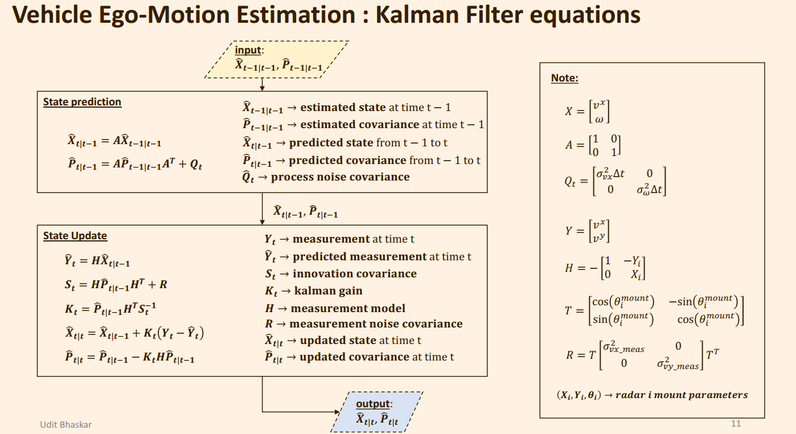

# 代码走读

- [Setup](#setup)
- [流程总览](#流程总览)
- [Stationary Measurement Identification](#stationary-measurement-identification)
  - [gate\_stationary\_meas](#gate_stationary_meas)
    - [predict\_range\_rate\_at\_meas\_locations](#predict_range_rate_at_meas_locations)
  - [为什么不需要用到点云Range属性？](#为什么不需要用到点云range属性)
- [Clutter Removal by RANSAC](#clutter-removal-by-ransac)
- [Radar Ego-Motion Computation](#radar-ego-motion-computation)
  - [1. 计算Vx\_rad, vy\_rad](#1-计算vx_rad-vy_rad)
  - [2. 计算Vx\_ego, vy\_ego](#2-计算vx_ego-vy_ego)
  - [3. 总结](#3-总结)
- [KF Filter](#kf-filter)
- [对比OLS和KF算法](#对比ols和kf算法)
  - [速度状态对比](#速度状态对比)
  - [角速度YwaRate状态对比](#角速度ywarate状态对比)
  - [总结](#总结)
- [总体算法总结](#总体算法总结)

---

<br>

## Setup

<div align=center>

</div>

<div align=center>

</div>


<br>

---

基于RadarScenes的车辆行驶状态估计。

[函数主入口: kalman_filtering_single_sensor](./python/filter_functions.py#L163)


## 流程总览

   - **Stationary Measurement Identification** : The stationary measurements are identified. First the predicted range-rate for stationarity case at each measurement (x,y) location is computed. If the measurement range-rate and the predicted range-rate is 'close' within a certain margin, then that measurement is considered for further processing. It may happen that the wheel speed based ego-motion is corrupted since the wheel is prone to slipping and skidding, in such cases the estimated ego-motion in the previous time t-1 is utilized for computing the predicted range-rate.<br>
   - **Clutter Removal by RANSAC** : After an preliminary selection of the stationary measurements, Random Sample Consensus (RANSAC) is used to remove clutter measurements.<br>
   - **Radar Ego-motion Computation** : Since radar gives only range-rate which is the radial component of the velocity vector ( NO orthogonal velocity component ) a full 3DOF ego motion is not possible using a single radar. Here we estimate translational radar ego-motion (vx, vy) using the method of Ordinary Least Squares.<br>
   - **Vehicle Ego-motion estimation** : Next the ego motion is computed w.r.t the wheel base center where it is assumed that the lateral velocity component is 0 ( vy = 0 )<br><br>


<div align=center>

</div>


<br><br>

## Stationary Measurement Identification

[函数入口](./python/ego_motion.py#L183)


<div align=center>

</div>

----

<details>
    <summary>Click to View Code</summary>

### gate_stationary_meas

```py
def gate_stationary_meas(ego_motion_prior, z, tx, ty, theta):
    """ given a prior estimate of the vehicle ego motion which can be either from vehicle odometry 
        or the predicted motion estimate from the previous state ego motion select measurements which are likeliy to be stationary
        Input: ego_motion_prior - ( vx_ego, vy_ego, yawrate_ego ) - a vector of vehicle ego motion
             : z - a matrix of radar measurements of size (n, 4). where each vmeasurement vector is ( range, azimuth, range_rate, rcs)
             : ( tx, ty ) - radar mounting position vector
             : theta - radar mount azimuth angle
        Output: z -  a vector of selected measurement
              : error - a vector of errors
    """
    vx_ego = ego_motion_prior[0]
    vy_ego = ego_motion_prior[1]
    yawrate_ego = ego_motion_prior[2]

    z_azimuth = z[:, const.rad_meas_attr['azimuth']]
    z_vr = z[:, const.rad_meas_attr['range_rate']]

    # 根据车辆的运动状态和雷达的安装参数，预测每个测量位置的径向速度
    vr_pred = predict_range_rate_at_meas_locations(vx_ego, vy_ego, yawrate_ego, z_azimuth, tx, ty, theta)

    # 和设定的阈值比较，进行动静点分离
    error = vr_pred - z_vr
    sel_z_flag = ( np.abs(error) <= const.gamma_stationary )
    z = z[sel_z_flag]
    error = error[sel_z_flag]
    return z, error
```

这段代码定义了一个函数 `gate_stationary_meas`，其目的是从一组雷达测量中选出那些可能代表静止目标的测量。这是通过比较实际的测量速度（径向速度）和根据车辆自身运动预测的径向速度来实现的。如果两者的差异在一定阈值内，该测量被认为是静止目标的测量。

1. 输入参数
   1. `ego_motion_prior`: 包含车辆自我运动的先验估计，格式为一个向量 `(vx_ego, vy_ego, yawrate_ego)`，其中包括车辆的横向速度、纵向速度和偏航率。
   2. `z`: 雷达测量的矩阵，每一行代表一个测量向量，包括距离、方位角、径向速率和雷达截面（RCS）。
   3. `tx`, `ty`: 雷达的安装位置向量，即雷达相对于车辆的横向和纵向位置。
   4. `theta`: 雷达的安装方位角。

2. 输出
   1. `z`: 经过筛选的测量矩阵，只包含可能代表静止目标的测量。
   2. `error`: 选出测量的预测径向速度与实际测量径向速度之间的误差向量。

3. 处理流程
   1. 从 `ego_motion_prior` 中提取车辆的横向速度 (`vx_ego`)、纵向速度 (`vy_ego`) 和偏航率 (`yawrate_ego`)。
   2. 从测量矩阵 `z` 中提取方位角 (`z_azimuth`) 和实际测量的径向速度 (`z_vr`)。
   3. 调用 `predict_range_rate_at_meas_locations` 函数，根据车辆的运动状态和雷达的安装参数，预测每个测量位置的径向速度 (`vr_pred`)。
   4. 计算预测径向速度与实际测量径向速度之间的误差 (`error`)。
   5. 根据误差的绝对值是否小于等于某个阈值 (`const.gamma_stationary`) 来选择可能代表静止目标的测量。这个阈值定义了误差的容忍度，用于判断目标是否为静止。
   6. 返回筛选后的测量矩阵和对应的误差向量。

#### predict_range_rate_at_meas_locations

> 根据**点云方位角**，并结合当前车辆运行状态（x_ego, vy_ego, yawrate_ego ）以及雷达安装信息，计算该**点云（静止）理论径向速度**。

```py

def coordinate_transform_vx_vy(vx, vy, theta):
    """ Coordinate transformation of the velocity vector from sensor frame to vehicle frame
    Input: ( vx, vy ) - velocity vector
         : theta - sensor mount azimuth angle
    Output: ( vx_cts, vy_cts ) - coordinate transformed velocity vector
    """
    vx_cts = vx * np.cos(theta) - vy * np.sin(theta)
    vy_cts = vx * np.sin(theta) + vy * np.cos(theta)
    return vx_cts, vy_cts


def generate_meas_sensor_frame(vx_ego, vy_ego, yawrate_ego, tx, ty, theta):
    """ compute velocity vector in the sensor frame at the sensor location given the ego motion
    Input: vx_ego, vy_ego, yawrate_ego - vehicle ego motion
         : ( tx, ty ) - radar mounting position vector
         : theta - radar mount azimuth angle
    Output: ( vx_sensor, vy_sensor ) - velocity vector in the sensor frame at the sensor location
    """
    vx_sensor = vx_ego - yawrate_ego * ty
    vy_sensor = vy_ego + yawrate_ego * tx
    vx_sensor, vy_sensor = coordinate_transform_vx_vy(vx_sensor, vy_sensor, -theta)
    return vx_sensor, vy_sensor


def predict_range_rate_at_meas_locations(vx_ego, vy_ego, yawrate_ego, meas_theta, tx, ty, theta):
    """ compute range rate at different locations in the radar FOV give the vehicle ego motion and sensor mount info
    Input: vx_ego, vy_ego, yawrate_ego - vehicle ego motion
         : meas_theta - an array of measurement azimuths
         : ( tx, ty ) - radar mounting position vector
         : theta - radar mount azimuth angle
    Output: vr_pred - computed range rates at the measurement locations 
    """
    vx_sensor, vy_sensor = generate_meas_sensor_frame(vx_ego, vy_ego, yawrate_ego, tx, ty, theta)
    vr_pred = -( vx_sensor * np.cos(meas_theta) + vy_sensor * np.sin(meas_theta) )
    return vr_pred
```

这些函数共同构成了一个处理车辆自我运动和雷达测量的系统，用于在车辆坐标系中转换和预测速度及径向速度。下面是每个函数的详细解释：

1. `coordinate_transform_vx_vy`
   
    这个函数用于将速度向量从传感器坐标系转换到车辆坐标系。

    - 输入
      - `vx`, `vy`: 传感器坐标系中的速度向量。
      - `theta`: 传感器安装的方位角。

    - 输出
      - `vx_cts`, `vy_cts`: 转换到车辆坐标系后的速度向量。

    - 处理过程
      - 使用旋转矩阵将速度从传感器坐标系（假设其与车辆坐标系之间有角度偏差`theta`）转换到车辆坐标系。
      - 旋转矩阵基于角度`theta`，使用余弦和正弦函数进行计算。

2. `generate_meas_sensor_frame`
   
    **这个函数计算给定车辆自我运动情况下，传感器位置的速度向量。**

    - 输入
      - `vx_ego`, `vy_ego`, `yawrate_ego`: 车辆的自我运动参数，包括横向和纵向速度以及偏航率。
      - `tx`, `ty`: 雷达相对于车辆中心的安装位置。
      - `theta`: 雷达安装的方位角。

    - 输出
      - `vx_sensor`, `vy_sensor`: 传感器坐标系中的速度向量。

    - 处理过程
      - 首先计算传感器位置的速度向量，根据偏航率和雷达的相对位置调整速度。
      - 使用 `coordinate_transform_vx_vy` 函数将速度从车辆坐标系转换到传感器坐标系。

3. `predict_range_rate_at_meas_locations`

    这个函数计算雷达视场中不同位置的预测径向速度。

    - 输入
      - `vx_ego`, `vy_ego`, `yawrate_ego`: 车辆的自我运动参数。
      - `meas_theta`: 测量的方位角数组。
      - `tx`, `ty`: 雷达的安装位置。
      - `theta`: 雷达的安装方位角。

    - 输出
      - `vr_pred`: 在测量位置计算得到的预测径向速度。

    - 处理过程
      - 使用 `generate_meas_sensor_frame` 函数获取传感器位置的速度向量。
      - 根据雷达测量的方位角计算每个位置的预测径向速度，使用余弦和正弦函数结合传感器速度进行计算。


### 为什么不需要用到点云Range属性？

- **径向速度的定义**
  
    径向速度 $v_r$ 是目标速度向量 $\vec{v}$ 在从雷达到目标的单位方向向量 $\hat{r}$ 上的投影。数学上，这可以表示为：
    $$ v_r = \vec{v} \cdot \hat{r} $$
    其中 $\cdot$ 表示向量的点积。

- **方向向量的计算**
  
    假设雷达到目标的方位角为 $\theta$，则可以定义单位方向向量 $\hat{r}$ 为：
    $$ \hat{r} = (\cos(\theta), \sin(\theta)) $$
    这里，$\theta$ 是从雷达到目标的方向角，通常是水平面上的角度。

- **目标速度向量**
  
    目标的速度向量 $\vec{v}$ 可以表示为：
    $$ \vec{v} = (v_x, v_y) $$
    其中 $v_x$ 和 $v_y$ 是目标在水平坐标系中的速度分量。

- **计算径向速度**
  
    将上述表达式代入径向速度的定义中，我们得到：
    $$ v_r = (v_x, v_y) \cdot (\cos(\theta), \sin(\theta))$$
    $$ v_r = v_x \cos(\theta) + v_y \sin(\theta) $$

-  **距离的角色**
  
    从上面的公式可以看出，计算 $v_r$ 仅依赖于 $v_x$、$v_y$ 和 $\theta$。这个计算不直接涉及到目标距离雷达的距离 $d$。距离 $d$ 影响的是目标的绝对位置，而不是速度的方向分量。因此，在计算径向速度时，距离信息不是必需的。

总结来说，径向速度的计算依赖于速度分量和目标相对于雷达的方向角，而与目标到雷达的具体距离无关。这就是为什么在计算径向速度时，只需角度信息而不需要距离信息的原因。


</details>


## Clutter Removal by RANSAC

[函数入口](./python/ego_motion.py#L115)

<div align=center>

</div>

---


<details>
    <summary>Click to View Code</summary>

```py
def ransac(z):
    """
    使用 RANSAC 算法估计雷达的自我运动。
    输入:
    z - 雷达测量的矩阵，大小为 (n, 4)，每个测量向量包括 (range, azimuth, range_rate, rcs)。

    输出:
    inliers_flag - 一个布尔数组，表示对应的测量是否为内点。
    is_valid - 一个布尔标志，表示测量是否可信。
    in_ratio - 内点数与总测量数的比例。
    """
    num_meas = z.shape[0]
    is_valid = False
    in_ratio = 0
    inliers_flag = np.zeros(z.shape[0], dtype=bool)

    if num_meas > 10:
        # RANSAC 参数
        num_iter = const.ransac_num_iterations
        error_margin = const.ransac_error_margin
        min_num_samples = const.ransac_min_num_samples
        in_ratio_thresh = const.inlier_ratio_threshold

        # 用于存储每次迭代的输出
        vx = np.zeros((num_iter, ))
        vy = np.zeros((num_iter, ))
        num_inliers = np.zeros((num_iter, ))
        inlier_ratio = np.zeros((num_iter, ))

        # 随机选择测量数据
        meas_idx = np.arange(z.shape[0])
        for i in range(num_iter):
            # 随机选择一部分测量作为共识集，并创建测试集
            np.random.shuffle(meas_idx)
            z_consensus_set = z[meas_idx[:min_num_samples]]
            z_test_set = z[meas_idx[min_num_samples:]]

            # 使用共识集计算雷达的自我运动
            meas_theta = z_consensus_set[:, const.rad_meas_attr['azimuth']]
            meas_vr = z_consensus_set[:, const.rad_meas_attr['range_rate']]
            vx_est, vy_est = estimate_sensor_vx_vy(meas_theta, meas_vr)

            # 使用计算得到的 vx, vy 预测测试集的 vr
            meas_theta_test = z_test_set[:, const.rad_meas_attr['azimuth']]
            meas_vr_test = z_test_set[:, const.rad_meas_attr['range_rate']]
            pred_vr_test = -(vx_est * np.cos(meas_theta_test) + vy_est * np.sin(meas_theta_test))

            # 计算误差并选择内点
            error = np.abs(meas_vr_test - pred_vr_test)
            inliers_flag = (error <= error_margin)

            # 计算输出结果
            vx[i] = vx_est
            vy[i] = vy_est
            num_inliers[i] = np.sum(inliers_flag)
            inlier_ratio[i] = (num_inliers[i] + min_num_samples) / num_meas

        # 根据内点数最多的结果确定最终的 vx, vy
        max_inlier_idx = np.argmax(num_inliers)
        vx_est = vx[max_inlier_idx]
        vy_est = vy[max_inlier_idx]
        in_ratio = inlier_ratio[max_inlier_idx]

        # 重新计算所有数据的内点
        meas_theta = z[:, const.rad_meas_attr['azimuth']]
        meas_vr = z[:, const.rad_meas_attr['range_rate']]
        pred_vr = -(vx_est * np.cos(meas_theta) + vy_est * np.sin(meas_theta))
        error = np.abs(meas_vr - pred_vr)
        inliers_flag = (error <= error_margin)

        # 根据内点比例确定测量的有效性
        if in_ratio >= in_ratio_thresh:
            is_valid = True

    return inliers_flag, is_valid, in_ratio
```

</details>


## Radar Ego-Motion Computation

<div align=center>

</div>

<details>
    <summary>Click to View Code</summary>

### 1. 计算Vx_rad, vy_rad

> 通过静态点的角度、径向速度来解算毫米波雷达速度。

<div align=center>

</div>


```py

def estimate_sensor_vx_vy(meas_theta, meas_vr):
    """ estimate radar ego-motion from stationary measurements
    Input: meas_theta - an array of measurement azimuths
         : meas_vr - an array of measurement range rate azimuths
    Output: ( vx, vy ) - radar translational ego motion
    """
    A = np.zeros((2,2))
    b = np.zeros((2,1))
    n = meas_theta.shape[0]
    for i in range(n):
        cos_t  = np.cos(meas_theta[i])
        sin_t  = np.sin(meas_theta[i])
        sin_2t = np.sin(2 * meas_theta[i])
        A[0,0] += ( cos_t ** 2 )
        A[0,1] += sin_2t
        b[0,0] -= ( cos_t * meas_vr[i] )
        b[1,0] -= ( sin_t * meas_vr[i] )
    A[0,1] = 0.5 * A[0,1]
    A[1,0] = A[0,1]
    A[1,1] = n - A[0,0]
    x = np.linalg.inv(A) @ b
    return x[0,0], x[1,0]
```

上述代码计算公式如下：

<div align=center>

</div>


<br>

### 2. 计算Vx_ego, vy_ego

> 通过毫米波雷达速度以及雷达安装角度，解算车辆速度。

<div align=center>

</div>


```py
def coordinate_transform_vx_vy(vx, vy, theta):
    """ Coordinate transformation of the velocity vector from sensor frame to vehicle frame
    Input: ( vx, vy ) - velocity vector
         : theta - sensor mount azimuth angle
    Output: ( vx_cts, vy_cts ) - coordinate transformed velocity vector
    """
    vx_cts = vx * np.cos(theta) - vy * np.sin(theta)
    vy_cts = vx * np.sin(theta) + vy * np.cos(theta)
    return vx_cts, vy_cts

def estimate_ego_vx_vy_yawrate(vx, vy, tx, ty):
    """ estimate vehicle ego motion w.r.t the rear wheel base center
    Input: ( vx, vy ) - radar translational ego motion w.r.t the vehicle rear wheel base center 
         : ( tx, ty ) - radar mounting position vector
    Output: ( vx_ego, vy_ego, yawrate_ego ) - vehicle ego motion
    """
    yawrate_ego = vy / tx
    vx_ego = vx + ty * yawrate_ego
    vy_ego = 0.0
    return vx_ego, vy_ego, yawrate_ego

```

上述代码的算法推导过程如下所示：

<div align=center>

</div>

<div align=center>

</div>


### 3. 总结

```py
  # 计算毫米波雷达速度
  vx_sensor, vy_sensor = estimate_sensor_vx_vy(meas_theta, meas_vr)
  # 坐标系转换
  vx_sensor, vy_sensor = coordinate_transform_vx_vy(vx_sensor, vy_sensor, theta)
  # 计算车辆速度和yawrate
  vx_ego, vy_ego, yawrate_ego = estimate_ego_vx_vy_yawrate(vx_sensor, vy_sensor, tx, ty)
```

</details>


## KF Filter

<div align=center>

</div>


```py
    if xxxx:
      ...

    # kalman filtering
    else:
        is_gated1 = False
        x_pred, P_pred = kalman_filter_pred(x_prev, P_prev, const.q, dt) 

        if is_valid:
            meas_theta = z[:, const.rad_meas_attr['azimuth']]
            meas_vr = z[:, const.rad_meas_attr['range_rate']]
            vx1, vy1 = estimate_sensor_vx_vy(meas_theta, meas_vr)
            is_gated1 = check_if_gated(x_pred[0], x_pred[1], vx1, vy1, tx, ty, theta, const.gamma_sq_vx_vy)

        vx2, vy2 = generate_meas_sensor_frame(vx_odom, 0.0, yaw_rate_odom, tx, ty, theta)
        is_gated2 = check_if_gated(x_pred[0], x_pred[1], vx2, vy2, tx, ty, theta, const.gamma_sq_vx_vy)

        condition = ( ( not is_gated1 ) and (not is_gated2 ) )
        if condition:
            x_upd = x_pred
            P_upd = P_pred
        else:
            if is_gated1:
                z = np.array([[vx1], [vy1]])
                R = const.R
            else:
                z = np.array([[vx2], [vy2]])
                R = const.R
            H = compute_meas_model(tx, ty, theta)
            x_upd, P_upd = kalman_filter_upd(x_pred, P_pred, z, R, H)

    return x_upd, P_upd
```

卡尔曼滤波过程不再描述，这里需要主要的是`if condition:`这个条件分支，流程中总共会用到两个传感器的输入，分别是`毫米波雷达`和`里程计`：

1. 两者均可不用时，不进行KF更新步骤；
   
2. 毫米波数据可用，使用毫米波雷达数据进行update；
   
3. 毫米波数据不可用，使用里程计数据进行update；
  

## 对比OLS和KF算法

OLS算法指的是直接使用单次ego_motion估计值作为本次最终输出值，也就是后续没有KF滤波；

也就是说，KF算法指的是在OLS输出的基础上，额外增加了一个卡尔曼滤波器进行状态滤波。


### 速度状态对比

<div align=center>

</div>

<div align=center>

</div>


### 角速度YwaRate状态对比

<div align=center>

</div>


### 总结

卡尔曼滤波算法开销很小，效果提升比较明显，工程中应优先使用KF算法。

## 总体算法总结

**动静点分离-->雷达速度估计-->本周期车辆状态估计-->卡尔曼滤波-->最终车辆状态估计输出**

